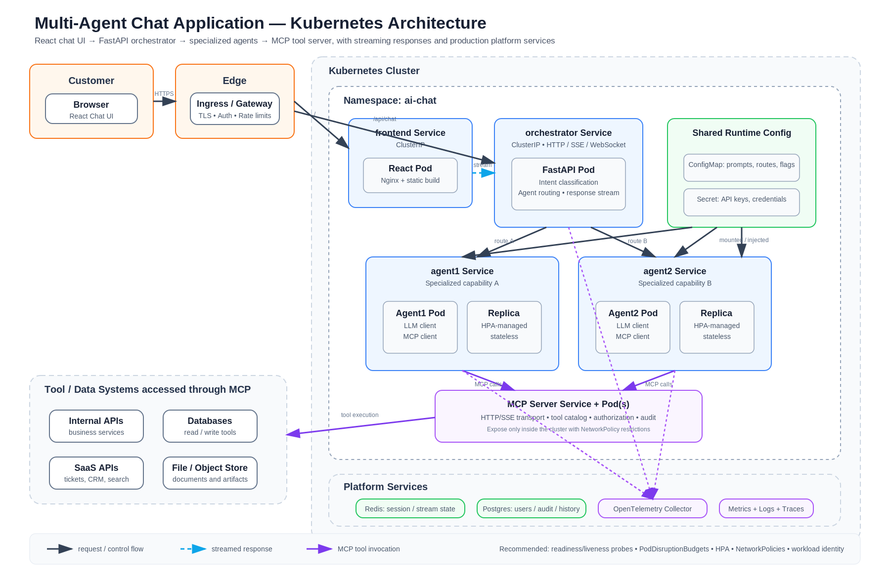

# Performance AI / AI Chat POC

This repo is a multi-service proof of concept for an agentic AI chat system
with an observability-first architecture. It currently contains a FastAPI
orchestrator, a baseline MCP server, two React/Vite UI shells, a vendor-neutral
OTLP Collector path, and a Helm chart for running the stack in Minikube.

The implementation is intentionally early-stage: the orchestrator has a stable
`/chat` contract and structured request logging, but still returns a placeholder
echo response; both UIs are still Vite starter screens; the agent and OTel
folders are reserved for upcoming work.

## Architecture

At a high level:

- `customer-ui/` is the future end-user chat experience.
- `dashboard-ui/` is the future operator/observability dashboard.
- `orchestrator-svc/` exposes `GET /health` and `POST /chat`.
- `mcp-server/` exposes a small FastMCP server with one demo `add` tool.
- `infra/helm/ai-chat/` deploys the application services to Kubernetes.
- `infra/helm/observability/` independently deploys the Collector and OpenObserve.
- `make/` contains the Docker, Minikube, Helm, and port-forward targets.
- `docs/` holds architecture artifacts, including the current infrastructure diagram.

Deployment architecture:



The intended future flow is:

```text
customer-ui -> orchestrator-svc -> agent services -> mcp-server
                                      |
                                      v
                                OTel/log pipeline
```

Today, only the API skeleton, MCP sample tool, containers, and Helm deployment
shape are present.

## Folder Map

Every non-generated folder has its own README with local notes:

- [`agent1-svc/`](agent1-svc/README.md) - reserved for the first future agent service.
- [`agent2-svc/`](agent2-svc/README.md) - reserved for the second future agent service.
- [`customer-ui/`](customer-ui/README.md) - customer-facing React/Vite app shell.
- [`dashboard-ui/`](dashboard-ui/README.md) - dashboard React/Vite app shell.
- [`docs/`](docs/README.md) - architecture images and future design notes.
- [`infra/`](infra/README.md) - deployment infrastructure.
- [`make/`](make/README.md) - included Makefile target groups.
- [`mcp-server/`](mcp-server/README.md) - baseline FastMCP service.
- [`orchestrator-svc/`](orchestrator-svc/README.md) - FastAPI API contract and logging details.
- [`otel/`](otel/README.md) - OTLP Collector configuration and telemetry notes.

Generated/vendor folders such as `node_modules/`, `dist/`, `.git/`, and build
output are intentionally not documented.

## Quick Start

### Orchestrator API

Requires Python 3.11+.

```bash
cd orchestrator-svc
python -m venv .venv
source .venv/bin/activate
pip install -r requirements.txt
cp .env.example .env
python -m app.main
```

Then try:

```bash
curl http://localhost:8001/health
curl -X POST http://localhost:8001/chat \
  -H "Content-Type: application/json" \
  -d '{"message": "hello"}'
```

### Customer UI

```bash
cd customer-ui
npm install
npm run dev
```

### Dashboard UI

```bash
cd dashboard-ui
npm install
npm run dev
```

### MCP Server

Requires Python 3.12+ if you want to match the Docker image.

```bash
cd mcp-server
python -m venv .venv
source .venv/bin/activate
pip install -r requirements.txt
python -m app.server
```

## Local Kubernetes

The root `Makefile` is organized around Docker, Minikube, and Helm.

```bash
make doctor
make dev
make status
```

`make dev` starts Minikube if needed, builds all service images, loads them
into Minikube, deploys the Helm chart, and prints deployment status.

Useful per-service targets:

```bash
make rebuild-customer-ui
make rebuild-dashboard-ui
make rebuild-orchestrator
make rebuild-mcp
```

Useful port-forward targets:

```bash
make port-forward-customer-ui
make port-forward-dashboard-ui
make port-forward-orchestrator
make port-forward-mcp
```

The chart also assigns NodePorts by default:

- Customer UI: `30080`
- Orchestrator API: `30081`
- Dashboard UI: `30082`

## Tests And Validation

```bash
cd orchestrator-svc
python -m pytest
```

```bash
cd customer-ui
npm run lint
npm run build
```

```bash
cd dashboard-ui
npm run lint
npm run build
```

```bash
make helm-lint
make helm-template
```

## Current Limitations

- The orchestrator returns `Received: <message>` instead of calling real agents.
- `agent1-svc/` and `agent2-svc/` are placeholders.
- The MCP server only exposes a demo `add(a, b)` tool.
- The UIs are still Vite scaffolds and do not call the orchestrator yet.
- The Collector currently uses the `debug` exporter; configure a backend exporter in the Collector when one is selected.
